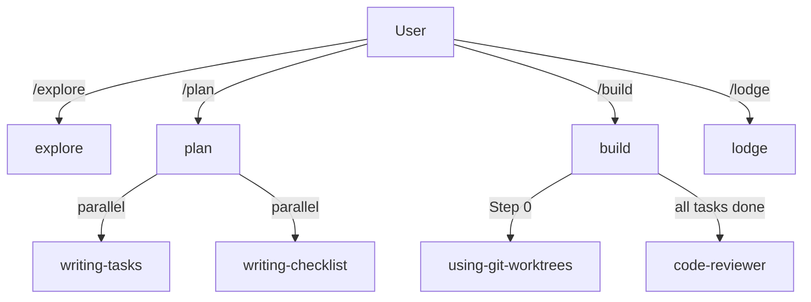

# Exploration: PBL Skills and Agents V2

> Generated on 2026-04-10
> Follow-up audit after 9 improvements applied in prior session. Reference: [v1 exploration](../2026-04-10-pbl-skills-agents/exploration.md)

## Overview

Post-improvement audit of the pbl plugin. All 9 issues from the v1 audit were addressed. The major improvements (parallel tasks+checklist, retry limit, worktree integration, outcome-oriented checklist) are well-implemented. Seven smaller gaps remain — mostly consistency issues, a stale intro, and one YAML formatting risk. The plugin is in significantly better shape than v1.

## Scope

- **Target**: `/pbl/` — all skills, agents, templates, and reference documents
- **Depth**: thorough (quality audit, post-change regression)

## Key Components

| Component | Path | Status |
|-----------|------|--------|
| explore | `skills/explore/SKILL.md` | Improved — fast-path works; Step 2 grouping could be clearer |
| plan | `skills/plan/SKILL.md` | Improved — parallel dispatch + cross-validation well-done; missing technical how-to |
| build | `skills/build/SKILL.md` | Improved — retry limit + Step 0 added; intro stale, Step 0 contradictory |
| lodge | `skills/lodge/SKILL.md` | Improved — review task check added |
| writing-tasks | `skills/writing-tasks/SKILL.md` | Improved — context: fork added |
| writing-checklist | `skills/writing-checklist/SKILL.md` | Improved — outcome-focused; context:fork missing space (YAML risk) |
| code-reviewer | `agents/code-reviewer.md` | Improved — typo "session" remains, location reference ambiguous |
| dispatching-parallel-agents | `skills/dispatching-parallel-agents/SKILL.md` | Fixed — Graphviz converted to Mermaid |
| tdd | `skills/build/references/tdd.md` | Fixed — Graphviz converted to Mermaid |

## Architecture

No structural changes from v1. Pipeline remains:

## Patterns & Conventions

All v1 patterns hold. New patterns added by improvements:
- **Parallel sub-skill dispatch**: `plan` now explicitly dispatches `writing-tasks` + `writing-checklist` concurrently — isolation enforced by `writing-checklist` not reading `tasks.md`
- **Retry-limited loops**: `build` checklist loop now has a 2x retry cap before user escalation
- **Unconditional cross-validation**: After both artifacts written, `plan` validates coverage in both directions (checklist → tasks, tasks → checklist)

## Notes

### Remaining Issues (7)

**High priority:**

1. **`writing-checklist/SKILL.md` — `context:fork` missing space (YAML parsing risk)**
   - `context:fork` should be `context: fork` — matches writing-tasks.md and is valid YAML.

2. **`build/SKILL.md` — Intro description is stale**
   - Still says "two-stage review after each: spec compliance review first, then code quality review." No spec compliance stage exists in the actual steps.
   - Fix: *"Execute tasks with TDD, verify against checklist, then dispatch code review — looping until all gates pass."*

3. **`build/SKILL.md` Step 0 — Contradictory logic**
   - Conditions worktree on "independent/parallelizable tasks" then immediately says "Even for sequential tasks, a worktree keeps build changes isolated."
   - Fix: Always invoke `using-git-worktrees`. Remove the conditional.

**Medium priority:**

4. **`plan/SKILL.md` Step 4 — No technical mechanism for parallel dispatch**
   - "Invoke both skills concurrently" doesn't explain HOW — practitioner may invoke sequentially.
   - Fix: Add "Dispatch both as simultaneous `Task()` calls in a single message — see `dispatching-parallel-agents` for the pattern."

5. **`code-reviewer.md` — "session" typo + ambiguous location**
   - "review report session below tasks in tasks.md" — "session" → "section"; format of the section is undefined.
   - Fix: "append a `## Review Notes` section to `tasks.md` documenting the deviation, and flag it as Critical."

**Low priority:**

6. **`writing-checklist/SKILL.md` — Inconsistent dash style in guidelines**
   - Em dash (`—`) for first example, hyphen (`-`) for second. Should be consistent.

7. **`explore/SKILL.md` Step 2 — Conditional block not visually grouped**
   - Items 2-4 only apply when vague but are flat-listed after item 1, making conditional logic implicit.
   - Fix: Nest items 2-4 under "If intent is vague or absent" or use a clear sub-header.
