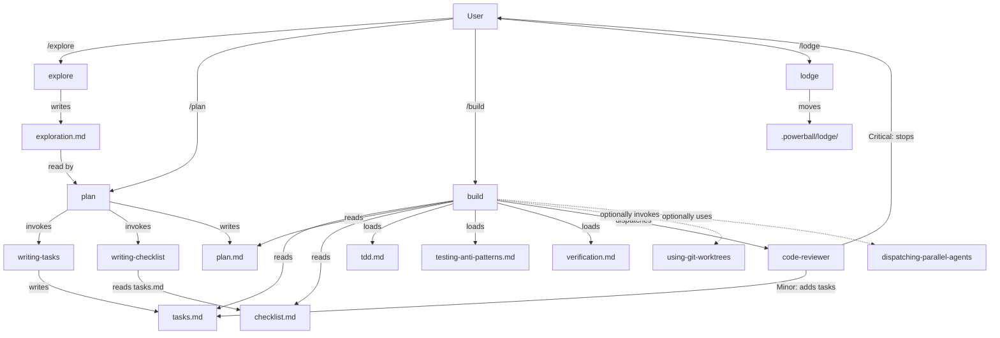

# Exploration: PBL Skills and Agents

> Generated on 2026-04-10

## Overview

The pbl plugin implements a spec-driven development loop (`explore → plan → build → lodge`) using structured markdown artifacts as shared state between phases. This exploration is a quality audit of all 9 skills and 1 agent, assessing what works well and what needs improvement. The plugin is well-architected overall, with strong verification culture and clean model tiering, but has several gaps in cross-component integration, loop safety, and consistency.

## Scope

- **Target**: `/pbl/` — all skills, agents, templates, and reference documents
- **Depth**: thorough

## Key Components

| Component | Path | Purpose |
|-----------|------|---------|
| explore | `skills/explore/SKILL.md` | Guided codebase exploration; saves `exploration.md` |
| plan | `skills/plan/SKILL.md` | Implementation planning; produces `plan.md`, `tasks.md`, `checklist.md` |
| build | `skills/build/SKILL.md` | Executes tasks with TDD, verifies checklist, runs code review |
| lodge | `skills/lodge/SKILL.md` | Archives completed specs from `specs/` to `lodge/` |
| writing-tasks | `skills/writing-tasks/SKILL.md` | Internal: breaks plan into ordered tasks |
| writing-checklist | `skills/writing-checklist/SKILL.md` | Internal: defines verification checkpoints |
| dispatching-parallel-agents | `skills/dispatching-parallel-agents/SKILL.md` | Internal: pattern for parallel agent dispatch |
| using-git-worktrees | `skills/using-git-worktrees/SKILL.md` | Creates isolated worktrees for feature branches |
| code-reviewer | `agents/code-reviewer.md` | Opus-model agent; reviews implementation against plan |
| tdd | `skills/build/references/tdd.md` | Reference: strict test-first rules |
| testing-anti-patterns | `skills/build/references/testing-anti-patterns.md` | Reference: mock and test quality rules |
| verification | `skills/build/references/verification.md` | Reference: evidence-before-claims protocol |

## Architecture

The pbl pipeline is a sequential four-phase loop, with internal sub-skills invoked during `plan`, and reference documents loaded during `build`.

All active work lives under `.powerball/specs/YYYY-MM-DD-{{name}}/`. Completed work is moved to `.powerball/lodge/` by the `lodge` skill.

## Patterns & Conventions

- **Doc-driven state machine**: checkbox `[ ]`/`[x]` in `tasks.md` and `checklist.md` is the entire execution state — resumable after any interruption
- **Date-prefixed directories**: `YYYY-MM-DD-{{name}}/` makes the workspace self-organizing and sortable
- **Mandatory Mermaid diagrams**: both exploration and plan templates require `graph TD` diagrams — makes architecture visible to agents reading later
- **Template-driven artifacts**: every document produced by a skill has a corresponding template in `templates/`
- **Iron Laws**: multiple "MUST" rules in references (tdd, verification, testing-anti-patterns) create a consistent no-fake-success culture
- **Lodge immutability**: docs in `.powerball/lodge/` are never overwritten — new work always goes to `specs/`
- **Model tiering**: `haiku` for simple ops, `sonnet` for execution, `opus` for design and review

## Dependencies

### External
- None (pure Claude Code plugin — no npm packages or external services)

### Internal
- `plan` depends on `explore` output (`exploration.md`) — will invoke explore if missing
- `writing-tasks` depends on `plan.md` and `exploration.md`
- `writing-checklist` depends on `tasks.md`, `plan.md`, and `exploration.md`
- `build` depends on `tasks.md`, `plan.md`, `checklist.md`
- `code-reviewer` is dispatched by `build` only
- `lodge` depends on `checklist.md` to verify completion

## Notes

### What's Done Well

1. **Four-phase pipeline with clean handoffs** — Intuitive flow, each artifact feeds the next phase. Well-named, consistent directory structure.
2. **Strong verification culture** — `tdd.md` + `testing-anti-patterns.md` + `verification.md` together close off common escape hatches. Rationalization tables are especially effective.
3. **Smart model tiering** — `haiku`/`sonnet`/`opus` chosen appropriately per task complexity.
4. **Code review feedback loop** — Critical/Minor classification is elegant. Auto-creates fix tasks for minor issues, stops for critical.
5. **Parallel agent dispatch documentation** — Clear decision flowchart, good do/don't-use sections, concrete real-world example.
6. **Resumability** — Checkbox state means any interrupted build can be resumed without re-reading all history.

### Issues Identified

1. **`explore` — Mandatory clarification adds friction for clear-intent arguments**
   - Always asks users to choose exploration angle even when argument contains explicit goal.
   - Fix: Fast-path when intent is explicit in the argument; only ask when vague.

2. **`build` — No escape hatch for looping checklist failures**
   - Loop on failure has no retry limit — could loop indefinitely if a task repeatedly fails the same checkpoint.
   - Fix: After 2 retries of the same checkpoint, surface to user with context and ask for guidance.

3. **`using-git-worktrees` — Integration with `build` is implicit, not enforced**
   - build.md never explicitly invokes the worktrees skill despite README saying it does.
   - Fix: Add explicit Step 0 to build.md to invoke worktrees before parallel task execution.

4. **`code-reviewer` — Communication Protocol language mismatches dispatch reality**
   - "Ask the coding agent to confirm" implies two-way conversation that doesn't exist in one-shot dispatch.
   - Fix: Replace with "flag as Critical for build to surface to user."

5. **`lodge` — Only checks checklist, not code review status**
   - Could archive specs with unresolved critical review findings.
   - Fix: Check for unresolved `Review fix:` tasks before allowing lodge.

6. **`writing-tasks` — Missing `context: fork`**
   - `writing-checklist` forks; `writing-tasks` doesn't. Both read same large files.
   - Fix: Add `context: fork` to writing-tasks frontmatter.

7. **`dispatching-parallel-agents` — Uses Graphviz `dot`, not Mermaid**
   - Plugin uses Mermaid everywhere else; the dot flowchart won't render in standard markdown viewers.
   - Fix: Convert to `flowchart TD` Mermaid format.

8. **`plan` — No cross-validation after tasks + checklist**
   - No check that every checklist item maps to at least one task.
   - Fix: Add cross-validation step after both artifacts are written.

9. **`checklist` template — TypeScript-specific example**
   - "No TypeScript errors or warnings" in a language-agnostic template.
   - Fix: Change to "Build passes with no warnings" or similar generic form.
